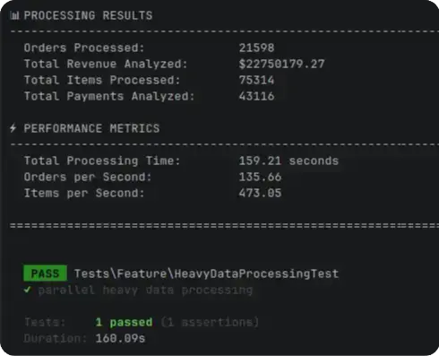
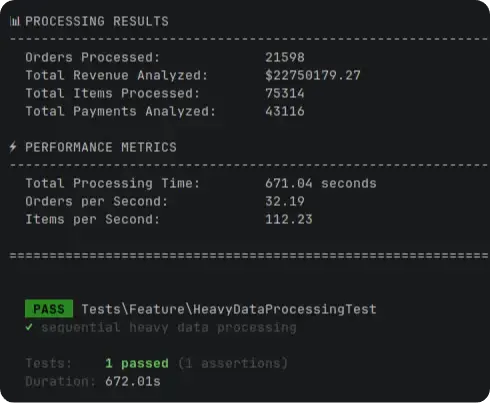

<div align="center">


# Parallite PHP

[](https://packagist.org/packages/parallite/parallite-php)
[](https://packagist.org/packages/parallite/parallite-php)
[](https://packagist.org/packages/parallite/parallite-php)

**Execute PHP closures in true parallel** — native `pcntl_fork` with zero dependencies, no daemon, no binary, no serialization.

</div>

---

## Features

- **True Parallel Execution** — `pcntl_fork` runs closures in separate processes simultaneously
- **Zero Dependencies** — only PHP 8.3+ with `ext-pcntl` and `ext-posix` (built-in)
- **No Daemon, No Binary** — no external process to install, start, or manage
- **No Closure Serialization** — forked processes inherit parent memory; closures run as-is
- **Simple async/await API** — familiar Promise-like interface with global helpers
- **Promise Chaining** — chainable `then()`, `catch()`, and `finally()` methods
- **Cross-platform** — fork mode on Linux/macOS, automatic sequential fallback on Windows
- **Benchmark Mode** — optional per-task metrics (execution time, memory, CPU)

## Requirements

- PHP 8.3+
- ext-pcntl (Linux/macOS — built-in, enables fork mode)
- ext-posix (Linux/macOS — built-in, enables fork mode)

> **Windows?** Parallite works on Windows in sequential fallback mode (no `pcntl_fork`). Parallel execution requires a Unix-like OS.

## Installation

```bash
composer require parallite/parallite-php
```

That's it. No binary to download, no daemon to start, no post-install scripts.

## Quick Start

```php
<?php

require 'vendor/autoload.php';

// Basic usage - no imports needed!
$result = await(async(fn() => 'Hello World'));
echo $result; // Hello World

// Parallel execution
$p1 = async(fn() => sleep(1) && 'Task 1');
$p2 = async(fn() => sleep(1) && 'Task 2');
$p3 = async(fn() => sleep(1) && 'Task 3');

$results = await([$p1, $p2, $p3]);
// Total time: ~1s (parallel) instead of 3s (sequential)

// Promise chaining
$result = await(
    async(fn() => 1 + 2)
        ->then(fn($n) => $n * 2)
        ->then(fn($n) => $n + 5)
);
echo $result; // 11

// Error handling
$result = await(
    async(function () {
        throw new Exception('Oops!');
    })->catch(fn($e) => 'Caught: ' . $e->getMessage())
);
echo $result; // Caught: Oops!
```

## Documentation

- **[Quick Start Guide](docs/quick-start.md)** — Get up and running in minutes
- **[Installation](docs/installation.md)** — Requirements and setup
- **[Configuration](docs/configuration.md)** — Benchmark mode and PHP includes
- **[API Reference](docs/api-reference.md)** — Complete API documentation
- **[Complex Data Handling](docs/complex-data-handling.md)** — How to handle complex data structures
- **[Troubleshooting](docs/troubleshooting.md)** — Common issues and solutions
- **[Examples](examples/)** — Real-world usage examples

## Performance

Parallite provides significant speedup for I/O-bound and CPU-bound tasks:

| Tasks | Sequential | Parallel | Speedup |
| ------- | ---------- | -------- | --------- |
| 3 × 1s | 3.0s | ~1.0s | **3.0x** |
| 5 × 2s | 10.0s | ~2.0s | **5.0x** |
| 10 × 1s | 10.0s | ~1.0s | **10.0x** |

```
Parallelism is beneficial when:

✅ CPU-intensive operations (image processing, complex calculations)
✅ Independent I/O-bound operations (external API calls, multiple databases)
✅ Database with good concurrency (MongoDB, PostgreSQL, SQL Server, MySQL)
❌ SQLite with concurrent writes
❌ Operations are already very fast
```

### Example using the Filamentphp demo

Project with + 20 thousand orders, simulating several heavy calculations and with json transformation, as if it were for a heavy dashbaord (when I have time, I'll add this demo project to git):

**✅ With Parallite:**



**🚫 Without Parallite:**



> The increase was approximately 321.4% in orders processed per second.


### Real-World Example

```php
// Fetch multiple APIs in parallel
$promises = [
    'users' => async(fn() => file_get_contents('https://api.example.com/users')),
    'posts' => async(fn() => file_get_contents('https://api.example.com/posts')),
    'comments' => async(fn() => file_get_contents('https://api.example.com/comments')),
];

$data = await($promises);
// 3x faster than sequential fetching!
```

## Platform Support

| Platform | Status | Notes |
| ----------- | ----------------- | -------------------- |
| **Linux** | ✅ Fully Supported | Fork mode (parallel) |
| **macOS** | ✅ Fully Supported | Fork mode (parallel) |
| **Windows** | ⚠️ Sequential Mode | No `pcntl_fork` — runs closures sequentially |

## Troubleshooting

Having issues? Check the **[Troubleshooting Guide](docs/troubleshooting.md)** for solutions.

**Quick tip:** Use `pd()` inside `async()` calls — it throws an exception with the dump data.

## How It Works

Parallite uses `pcntl_fork()` to create child processes that inherit the parent's entire memory space. This means:

1. **No closure serialization** — closures run directly in the forked process
2. **No external daemon** — each `async()` call forks immediately
3. **No startup overhead** — fork is near-instantaneous (~0.1ms)
4. **Simple IPC** — child writes result to a temp file, parent reads it on `await()`

## Contributing

Contributions are welcome! Please feel free to submit a Pull Request.

## License

This project is licensed under the MIT License — see the [LICENSE](LICENSE) file for details.

## Credits

- **Inspired by**: [Pokio](https://github.com/nunomaduro/pokio)

## Support

- **Issues**: [GitHub Issues](https://github.com/parallite/parallite-php/issues)
- **Discussions**: [GitHub Discussions](https://github.com/parallite/parallite-php/discussions)

---

<div align="center">

Made with ❤️ by the Parallite community

</div>
